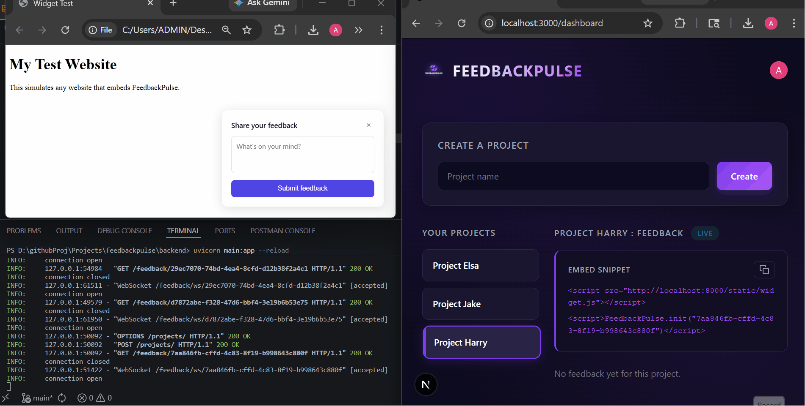

# Build Journal : FeedbackPulse

A day by day development log of building FeedbackPulse from scratch in a 10-day sprint.
Each day includes detailed notes covering concepts learned, code explanations, errors faced, and solutions.

---

## What is FeedbackPulse?

An AI-powered micro-SaaS where product teams embed a lightweight widget on their website to collect user feedback. The dashboard shows feedback in real time, and Gemini AI summarizes it into actionable insights.

**Stack :** Next.js · FastAPI · PostgreSQL · Clerk · WebSockets · Gemini API · Stripe

---

## Visual Build Log

### Day 6 : Gemini AI Feedback Summarization

> One click on Get AI Summary reads all collected feedback for the project and returns structured AI insights : main themes, overall sentiment, and the top 3 actionable improvements. Powered by Gemini 2.5 Flash.

---

### Day 5 : Real-Time Dashboard with WebSockets

> Feedback submitted via the embeddable widget appears instantly on the dashboard via WebSockets. No page refresh needed. The LIVE badge confirms the persistent connection is active.

---

## Daily Notes Index

| Day    | Topic                                       | Notes                                |
| ------ | ------------------------------------------- | ------------------------------------ |
| Day 1  | Project setup, Next.js, FastAPI, Clerk auth | [day-01-notes.md](./day-01-notes.md) |
| Day 2  | PostgreSQL, SQLAlchemy, Supabase            | [day-02-notes.md](./day-02-notes.md) |
| Day 3  | Feedback API, embeddable widget             | [day-03-notes.md](./day-03-notes.md) |
| Day 4  | Dashboard UI, user sync, CSS Modules        | [day-04-notes.md](./day-04-notes.md) |
| Day 5  | WebSockets, real-time updates, LIVE badge   | [day-05-notes.md](./day-05-notes.md) |
| Day 6  | Gemini AI summarization                     | [day-06-notes.md](./day-06-notes.md) |
| Day 7  | Stripe billing                              | Coming soon                          |
| Day 8  | Deployment : Vercel + Render                | Coming soon                          |
| Day 9  | Polish + demo video                         | Coming soon                          |
| Day 10 | Launch                                      | Coming soon                          |

## Author

**Amit Kumar** : Full-Stack Developer
Building end-to-end SaaS products with Next.js, FastAPI, and AI integrations.

[LinkedIn](https://www.linkedin.com/in/amit-kumar-160767191/) · [GitHub](https://github.com/AK-Amit-Kumar)
